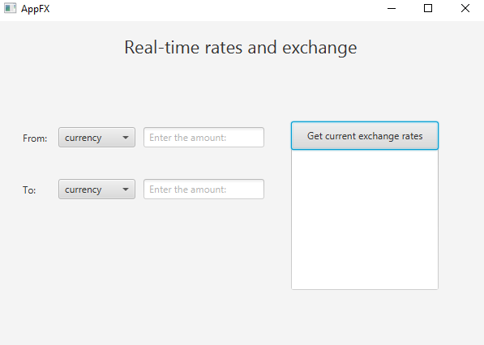

# FxCurrencyRealTimeRates

**Status:** *In Progress*

FXCurrencyRealTimeRates is a desktop application developed using **JavaFX** that fetches real-time currency exchange rates from the **National Bank of Poland (NBP) API** and allows users to convert from **PLN** to **USD** at the current rates.

## Technologies Used

- **JavaFX**: For building the user interface (UI) of the application.
- **Gradle**: For project automation and dependency management.
- **JUnit 5**: For unit testing, including `@BeforeEach` and `@Test` annotations.
- **TestFX**: For UI testing and integration with JUnit 5 using `ApplicationTest`.
- **FXML**: For UI design and separation of logic and presentation.
- **Scene Builder**: For designing the UI layout visually.
- **Java 23**: The latest version of Java for the application’s core functionality.

## Features

- Fetches real-time exchange rates for various currencies directly from the **NBP API**.
- Displays the exchange rates on the user interface.
- Allows conversion between **PLN** and **USD** using the current exchange rate.
- User-friendly interface created with **FXML** and **Scene Builder**.
- Unit tests to ensure functionality and reliability, with integration testing via **TestFX**.

## Screenshots

## Work In Progress

This application is still under development. Features may be added, and enhancements are ongoing to improve the overall user experience.
